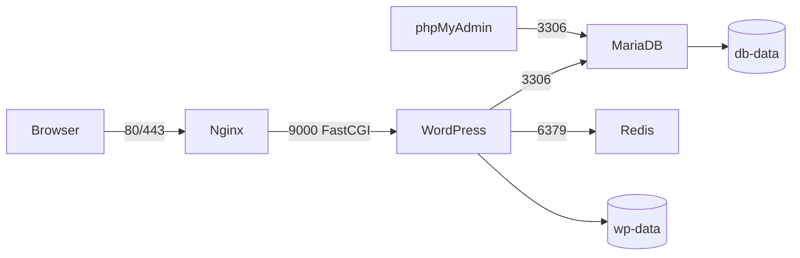

# Cloud-1 Correction Notes

## What It Does

Ansible deploys a Docker Compose WordPress stack on a remote Ubuntu 20.04 server.



## Files To Explain

- `deploy.sh`: checks env vars, installs Ansible collections, runs the chosen playbook.
- `ansible.cfg`: default inventory, SSH settings, root privilege escalation.
- `inventory/hosts.yml`: target server list; add hosts here for parallel deploy.
- `inventory/group_vars/all.yml`: shared variables for domain, paths, ports, users, passwords.
- `playbooks/site.yml`: full deploy: `common`, `docker`, `firewall`, `cloudone`.
- `roles/common`: base packages and persistent directories.
- `roles/docker`: Docker Engine and Compose plugin.
- `roles/firewall`: UFW default deny, allow SSH/HTTP/HTTPS.
- `roles/cloudone`: copy compose files, write secrets and `.env`, start containers.

## Core Concepts

- Automation: `./deploy.sh deploy` runs everything through Ansible.
- Idempotence: rerunning playbooks brings the server back to the expected state.
- One process per container: Nginx, WordPress/PHP-FPM, MariaDB, Redis, phpMyAdmin.
- Internal networking: DB/Redis/PHP-FPM use Docker network names, not public ports.
- Persistence: `db-data` stores MariaDB data; `wp-data` stores WordPress files/uploads.
- Restart: containers use `restart: unless-stopped`; Docker service is enabled on boot.
- Security: UFW limits public access; phpMyAdmin is localhost-only and accessed by SSH tunnel.
- TLS: Nginx serves HTTPS with a generated self-signed certificate.

## Demo Commands

```bash
./deploy.sh deploy
ssh root@$SERVER_IP "docker ps"
ssh root@$SERVER_IP "docker compose -f /opt/cloudone/docker-compose.yml ps"
ssh -L 8081:localhost:8081 root@$SERVER_IP
```

## Important Note

The official subject asks for automated deployment and the ability to deploy on several servers in parallel. This repo satisfies that.

The old correction sheet asks for extra production HA features: load balancer, separate DB server, shared media storage, autoscaling, alerts, and DB failover. Those require cloud-provider infrastructure outside this minimal Ansible/Compose repo.
